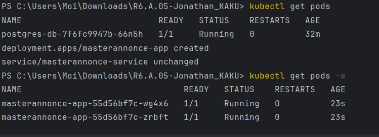
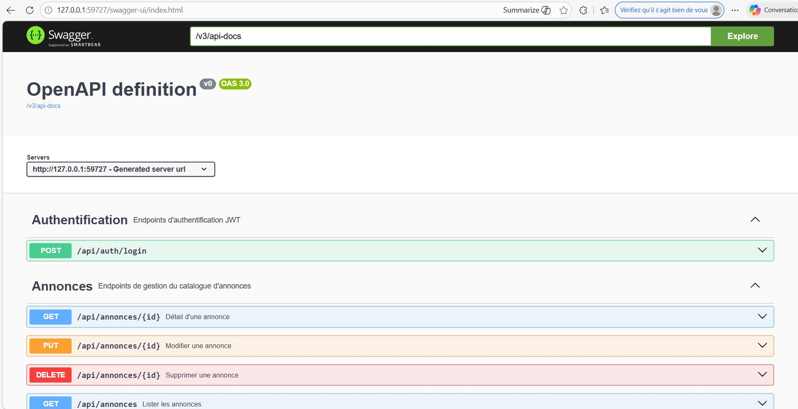

# MasterAnnonce - Migration Spring Boot & Kubernetes (TP4)

Ce projet est la version finalisée et industrialisée de l'application MasterAnnonce. Il marque la migration complète d'une architecture Jakarta EE / JAX-RS (TP3) vers l'écosystème **Spring Boot**, couplé à un déploiement Cloud Native via **Docker et Kubernetes**.

## Bilan Pédagogique : Ce que Spring a changé

La migration vers Spring Boot a permis de moderniser le code et de comprendre les mécanismes d'automatisation du framework :

* **Ce que Spring automatise :** * La configuration du serveur web (Tomcat embarqué).
    * L'injection de dépendances (`@Service`, `@RestController`) sans configuration XML.
    * Le mapping DTO ↔ Entity grâce à l'intégration de **MapStruct**.
* **Ce qu'il simplifie (Spring Data JPA) :** * Finies les requêtes JPQL manuelles et la gestion lourde de l'`EntityManager`. Les interfaces (`JpaRepository`) génèrent les requêtes SQL automatiquement à partir du nom des méthodes.
    * La gestion des transactions est désormais gérée par une simple annotation (`@Transactional`).
* **Ce qu'il masque (Spring AOP & Security) :** * **AOP :** Les logs de performance des méthodes métier sont externalisés dans un *Aspect*, gardant le code métier propre.
    * **Security :** Remplacement de JAAS par une chaîne de filtres Spring Security qui intercepte, valide le token JWT et peuple le contexte de sécurité de manière transparente.

---

## Architecture et Déploiement

L'application n'utilise plus de configuration en dur. Toutes les variables d'environnement (Base de données, Clés JWT) sont injectées dynamiquement par Kubernetes via des `ConfigMap` et `Secret`.

### 🛠️ Prérequis
* Docker
* Minikube & Kubectl
* Java 17 & Maven

### Commandes d'exécution (Minikube)

Pour lancer le projet localement, exécutez ces commandes dans l'ordre :

```bash
# 1. Compiler l'application Java
mvn clean package -DskipTests

# 2. Démarrer le cluster local
minikube start

# 3. Lier le terminal Windows au Docker de Minikube
minikube docker-env | Invoke-Expression

# 4. Construire l'image Docker de l'application
docker build -t masterannonce:1.0 .

# 5. Déployer la BDD et l'Application sur Kubernetes
kubectl apply -f k8s/

# 6. Vérifier l'état des pods
kubectl get pods -w

# 7. Exposer le service pour y accéder depuis le navigateur
minikube service masterannonce-service
```

## Preuves de Validation (Captures d'écran)

> **Note au correcteur :** Voici les preuves d'exécution demandées par le TP.

### 1. Preuve des Probes et de la Scalabilité
*Les 2 réplicas de l'application et la base de données sont en état `READY 1/1`.*



---

### 2. Preuve du fonctionnement de l'API (Swagger / Swagger UI)
*Appel réussi sur le endpoint `POST /api/auth/login` (Génération du Token JWT) et `GET /api/annonces` via l'URL Minikube.*

